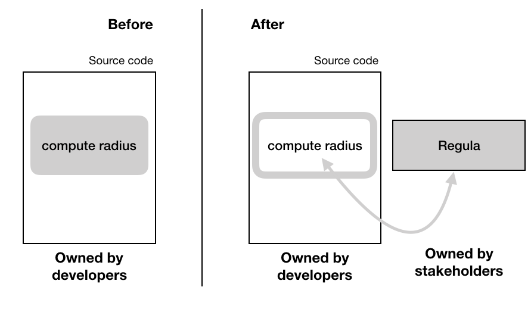
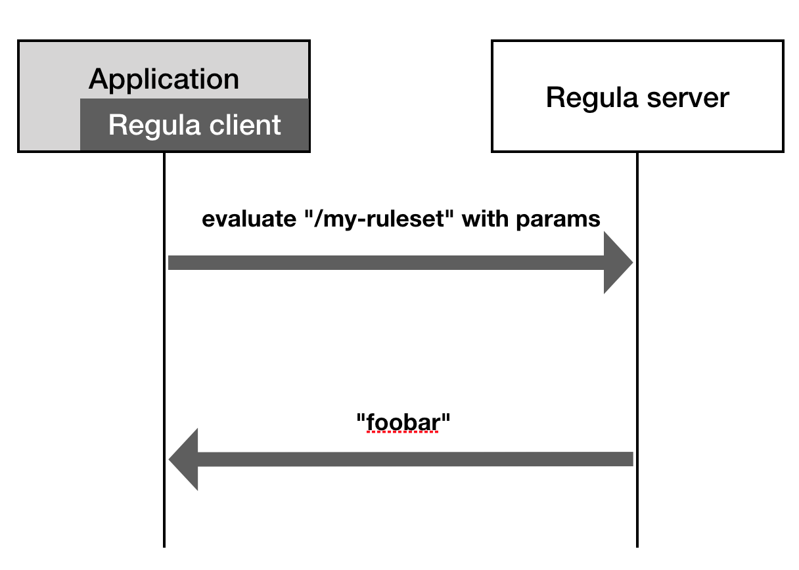

# Regula

## Overview

The "Regula" project addresses the problem caused by the accumulation of simple but recurrently changing logic due to business requirements. This introduces strains on the development cycle by reducing the velocity. In concrete terms, developers can find themselves always chasing the business rather than focusing on core logic which defines the business.

A solution to his kind of problems is a "Business Rules engine" or "Production Rule System". It solves it by providing a way to extract logic by creating "rules" that dictates a result under precise conditions. 

Such rules are ordered and composed of a condition and an action - simplistically, it's a bunch of ordered if-then statements. [Learn more about Rule-Engines](https://martinfowler.com/bliki/RulesEngine.html).

What really makes this approach shine is that stakeholders can change the rules themselves, without having to wait for developers to implement it. This enables much faster development cycles.

Example: Let's say there's a ride-sharing company that needs to adjust the radius in which it can match drivers and passengers. This changes a lot, depending on various real life events:

```
Given I want to know "What radius should I match driver and passenger with" in my code 
And I don't want to hardcode the logic
When I query the ruleset named "/ride-marketplace/radius"
And that I submit "product", "driver-status" and "city"
Then I get a radius value based on rules that have been defined by product owners

---

radius = 
  // Product people can update these rules on their own
  // Codebase using Regula will receive those updates live
  if city == "france-paris" AND driver-status == "gold" then 3.0
  if city == "france-paris" then 2.0
  if city == "italy-milan" then 1.5
  // catch all clause, acts as a default
  if true then 1.0
```

### How does it help being productive

So once developers and stakeholders have agreed on what simple logic will be extracted, it is possible to split the ownership in two:

- "when and how it's being used": developers own the context. Developers are responsible on how that logic is being used inside the codebase.
- "how is it computed ": stakeholders own the behaviour. Stakeholders can update the logic itself in total autonomy. 


The following diagrams highlights this split, with a **ruleset** that computes a radius. 




| Before                                                            | After |
|-------------------------------------------------------------------|-------|
| 1⃣ Developers and stakeholders agrees on a given solution   | 1⃣ Same  |
| 2⃣ Stakeholders write specifications                        | 2⃣ Stakeholders and developers agrees on how what parameters the ruleset should take as well as its return type: **developers create the ruleset on Regula.**
| 3⃣  Developers implement the solution                      | 3⃣ Developers uses Regula clients to query the ruleset with the agreed upon parameters and return type. **(Much shorter!)**|
| 4⃣ Stakeholders update the specifications when the situation changes  | 4⃣ **Stakeholders directly update the ruleset when needed** |
| 5⃣ Developers update the code accordingly                   | ✨ **Developers are not involved at all** |

The key point to remember here is that once a **ruleset** has been created, stakeholders can never break the contract of taking specific paremeters and returning a specific type. They can only change how the result is computed. It's that specific constraint that allows to split ownership responsibly. 

Regula takes a strongly opiniated approach in implementing this solution in order to provide strong predictability and reliability. Those are detailed in the "design principles" section below.


### What Regula provides

Regula is a solution available to backend developers, mobile developers as well as on the front-end. 

Currently, those are the supported environments: 

- Go
- Elixir
- Mobile Apps, through Go-mobile

## Terminology

A **rule** is a condition that takes parameters and if matched, returns a **result** of a certain type. 

It can be illustrated as following in pseudo-code:

```
  # string city and string driver-status are parameters
  if city == "france-paris" AND driver-status == "gold" then 3.0
```

A **ruleset** is an ordered list of **rules** that return results of the same type. It is named which allows to identify it. Rules are evaluated from top to bottom until one matches. 

This is a **ruleset** named `/marketplace/radius`
```
  if city == "france-paris" AND driver-status == "gold" then 3.0
  if city == "france-paris" then 2.0
  if city == "italy-milan" then 1.5
  if true then 1.0
```

A **signature** is the combination of a ruleset name, its parameters and their types and finally the result type. Once defined, it's set into stone and cannot be changed (to do so, create another ruleset).

It can be illustrated as following (still in pseudo-code):

```
float64 /marketplace/radius(string city, string driver-status)
```


A **version** is an identifier that enables to refers to a specific version of a ruleset. Each time a ruleset has at least one of its rules updated, a new **version** is created to identify it.

**Ruleset version: ** `4`
```
  # ruleset: /marketplace/radius
  if city == "france-paris" AND driver-status == "gold" then 3.0
  if city == "france-paris" then 2.0
  if city == "italy-milan" then 1.5
  if true then 1.0
```

Let's update the results on certain rules: 

**Ruleset version: ** `5`
```
  # ruleset: /marketplace/radius
  if city == "france-paris" AND driver-status == "gold" then 6.0
  # a rule can updated in both its conditions and result
  if city == "france-paris" OR city == "france-lyon" then 4.0
  if city == "italy-milan" then 3.0
  if true then 1.0
```

## Creating and updating rulesets

Stakeholders can agree with developers and they will create a ruleset. Once created, stakeholders can edit rulesets in full autonomy, with the guarantee of not breaking the code. Updating a ruleset means, in concrete terms to either change one or multiple rules, by changing their conditions or their result. 

Whether to use Regula or not for a given business problem should be done by answering the following questions:

- the behaviour is changing often or is supposed to evolve a lot
- the behaviour is relying entirely on business facts 

If the answer is yes for both of them, then creating a ruleset is a good idea. 


In the current release of Regula (`0.5.0`) stakeholders can only create or edits rules through scripts which require some engineering knowledge. Later version will include a proper UI for stakeholders to interact with Regula in a simple manner. 


## Components overview 

> ⚠ TODO: we should discuss what we want to bring in here, this can get quite complex really quick.



- Regula clients are querying Regula server
  - they live in the source code of a given application
  - when high performances are required, i.e. ruleset evaluations should be as fast as possible, there are caching mechanism available in some clients. See more about this in the technical documentation.
  
- Regula server answers requests from the clients. 
- Rulesets storage is where the rulesets and their versions are being kept. It is not supposed to be interacted with directly.

## Design principles

Rules engines are delicate beasts. It is important to remember that technically, it's about extracting behaviour from the source code and relocating it outside in a more "accessible" place that is outside of any continuous integration mechanism. 

Regula takes an opinionated approach to lower the risks and make it harder to break from expected behaviours. Regula's team objective is to focus on a curated feature set, putting reliability and predictability at a top priority. 

## Predictability 

Regula, by splitting the ownership of a given functionality of the software that uses it, needs to be predictable. Behaviour being owned by whoever edits the rules, it is mandatory that a given ruleset is not able to break the software that uses it. 

On developers side:

Regula is "typed" and that is why the concept of **signature** exists, illustrated by:

```
float64 /marketplace/radius(string city, string driver-status)
```

By doing so, it allows developers of both typed and dynamic languages to be certain that they always get a value of a given type. Changing the signature implies to create a new rule and such a break will logically require to edit the source code of the application using Regula to reflect the change. 

On stakeholders side: 

Regula rulesets are "versioned", meaning every updates to rulesets are tracked. By doing so, it is possible for stakeholders to observe how the behaviour is evolving. 

Moreover, versioning allows stakeholders to to take versions in consideration while designing a product. A given business object could be stored with the version of rulesets it is intended to use throughout its life, making it. If a given promotion coupon for example had been applied on a product being sold, by storing the version used, it can easily be computed again against that version, allowing to get the same exact result. 

By doing so, it enables stakeholder to know which path was taken to compute a given value, whether it's in the application logs or stored within a business object. 

## Reliability

Regula depends on two facts to be reliable: rulesets storage should be reliable, regula itself hould be reliable. 

Therefore: 

- All data is stored in an etcd store, which **should be distributed properly** (at least three instances in production, ideally on multiple avaibility zones).

- There should be multiple instances of Regula, **which should be distributed properly** (at least two instances in production, ideally on multiple availability zones, so there is no single point of failure).
