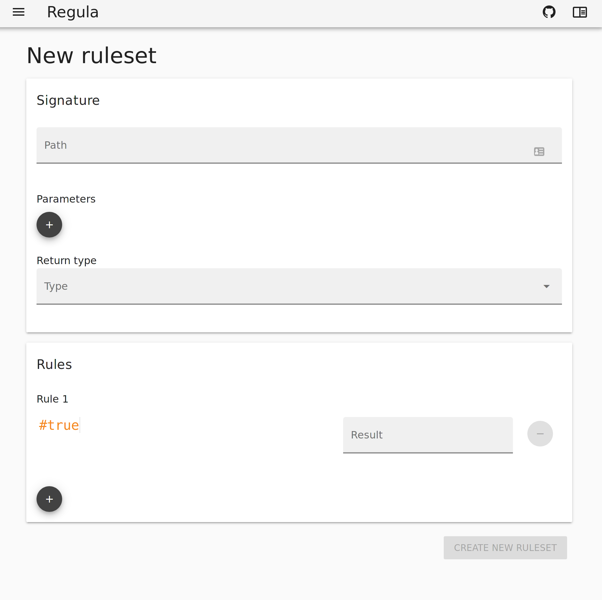

# The Book of RUSE
## Introduction
Once upon a time, in a company far, far away, their was a product manager called Blanche.  Blanche works with a team of 7 software engineers, named Heureux, Somnolent, Éternuement, Grincheuse, Timide, Dopé, and Dave.  Together they craft an app that allows the elderly to arrange rides on carriages from the crypto-mines to the city and back.    Blanche trusts and respects the software engineers, and believes in their insistence that she must wait for long periods between releaseses of their software whilst they finely craft every detail.  However, many times Blanche becomes frustrated because she doesn't have the ability to fine tune her software running in production.  Conditions are always changing, and she'd like to have the app reflect it.  Here are some example cases Blanche has noticed in her data stream:

- On Mondays there are very few elderly folks looking for a ride to the city. 
- Wood cutters are not allowed to ride, but there are often tired wood cutters ask about the service. 
- On Thursdays pensions are paid in the city and the carriages will all be fully occupied.
- In the autumn some of the elderly folk like to use the service to travel to orchards and return with apples.
- Poisoning of carriage drivers is a reoccurring issue.  It only seems to happen in the autumn. 

Blanche would like to try out some ideas to help improve the service and reduce the number of carriage drivers being poisoned.  Sadly the release cycle of her app is simply too long to allow these tweaks and experiments to be carried out in a reasonable way.  One day however, when she was moaning about this to Somnolent, Grincheuse overheard, and she interjected to say:

> Oh do shut up moaning Blanche.  Just use Regula, you idiot.

Now, Blanche was used to Grincheuse's little outbursts, so she thought nothing of her rough words, but she enquired. 

> Oh dear Grincheuse, a regular what?

To which Gincheuse replied:

> Nah, you bloomin' nincompoop, not "Regular", "Regula", it's a bleedin' rules engine, init. 

Blanche looked confused:

> But what is a rules engine?

At this point Somnolent, who had woken from all the commotion, stepped in:

> A rules engine... 

.. he paused to stretch and yawn ... 

> ... is a way to put some specific logic outside of a computer
> program, and have that program respect it.  The program gives the
> rules engine the relevant facts, and asks the rules engine to make a
> decision.  The way that decision is made is up to the person
> controlling the rules, not the program, so the rules can change at
> any time.

Blanche stopped and pondered this for a while.  She casually brushed a bluebird from her hair, where it had landed and become entangled, and jumped a little and she narrowly avoided kicking the rabbits that had gathered around her ankles. Then she said:

> Oh, that sounds exactly what I need, but Somnolent, Grincheuse how
> could I possibly define the logic for the rules, I am not a software
> engineer like you.  I am too tall, to go down the software mines for
> starters!

Grincheuse turned back to Blanche with a steely look:

> Are you still blathering on?  Look it's easy, even for an numskull
> like you.  There's a very simple, high level language called RUSE.

Blanche was beginning regret asking, but at that moment Timide, who
had been waiting quietly at Blanche's side for the last minute or so
cleared his throat and handed Blanche a book.  It was called "The Book
of RUSE".  Blanche opened it eagerly and speed-read the introduction. 

> Hang on?

.. she said...

> This is the conversation we've just been having.

Éternuement farted. 

## Of signatures and software engineers

Blanche found a quiet spot in the corner of the office, and sat down on a big sofa.  She opened the book and began to read the second chapter.  After reading a few paragraphs, she noticed that the seven software engineers were pushing aside the woodland animals that usually accompanied her, and were pulling up stools around her.  She had the creeping, uncomfortable realisation that this was becoming a meeting.  She thought she'd better give the meeting some direction:

> It says here that before I can write rules I have to agree a rule-set signature with the software engineers.

Grincheuse didn't attempt to disguise her smirk as she responded:

> Only if you want the app to actually do something when you provided rules. 

Luckily Heureux took a more conciliatory tone:

> Yes, that's quite right Blanche. The app has to know when to consult
> Regula for a decision.  It also need to know what information its
> supposed to give to Regula to support making that decision, and what
> type of information it's supposed to give back.

Blanche thought a little and then asked:

> If the app has to know that up front, how can this help me add dynamic behaviour to the app?

Heureux smiled kindly and answered:

> This is a very important point.  Regula and RUSE aren't there to
> make the app do new things, we still determine what the app *can*
> do, but the rules determine *what* it should do in a given
> situation.  They're like an especially flexible settings panel for
> the app.
>
> The software engineers, and the product manager can agree up front
> what aspects of the system should be tweakable, what information
> would be needed to make these decisions and what type of information
> is communicated back to the app when a decision is made.
>
> This combination or information, combined with a unique path to the
> ruleset constitutes its signature and that is the contract between
> the software engineering team and the product manager.  The software
> engineering team can trust the contract before the product manager
> ever attempts to create a rule.  They can build that signature into
> their code and they can rely on Regula to give them meaningful
> responses before any rules exist, and when they they are added.  The
> product manager can rely on the software to respect the contract and
> have confidence that they won't break the software by writing rules
> in the ruleset.

Blanche nodded sagely, then continued.

> So what does it mean that you need to know the *type* of information
> the rule set gives back?

Heureux took a deep breath, and said: 

> So, every piece of information we use in a computer program has a
> type.  This includes every parameter our app gives to Regula and the
> information Regula gives back to the original program. All of these
> pieces of information must have a type.
>
> The parameters we pass to a ruleset must also have names, so that we
> can refer to them within our rules.  The value the rule-set returns
> doesn't need a name, but it will need a type as well.
>
>The combination of the rule-set name, the names and types of the
>parameters, and the type of the returned value is called the
>"signature" of the rule-set.

Heureux paused and walked over the whiteboard.  He drew quickly scribbled a rought drawing of part of the Regula UI.

This is the rule-set creation UI.  If we look at the right
hand side of the screen we can see the heading "New ruleset" and
directly below this we see a "Path" field. This should be a unique
identifier for your rule. It should start and end with a letter or
number, but it can contain dashes and slashes in its body.  By
convention we use slashes to indicate hierarchy and dashes to
separate words in any given level of the hierarchy. Lets say we want
a collection of rulesets for the "book of ruse, and within that set
we want a sub-set called "examples", and within that subset we want
a rule-set called "signature example", we'd create that with the
path:

    book-of-ruse/examples/signature-example

OK, below this we see the heading "Parameters" and a big "+" button.
If we click on that button two new fields appear: "Name" and "Type".
We can add as many of these paramters as we like, and remove them
again using the big red "-" button at the end of each line.  The
"Name" field should contain something meaningful that describes what
information it will contain.  That name must start with a letter,
but it can also contain numbers and dashes, though it cannot end
with a dash.  For this example we'll add a parameter called:

   day-of-the-week 
Now we have to select a type for our parameter. There are four choices:

   - Int64
   - Float64
   - Bool
   - String

An Int64 is a number without any decimal places: 1, 2 or -220003030
for example.  A float64 is a number with decimals places: 1.23, 3.14
or -99.9494 are all examples. A Bool (short for Boolean) is either
true or false, you can think of it like a light switch, it's either on
or off (true of false).  A string is just some text, it can contain
spaces, punctuation, numbers, pretty much anything.  We have two valid
choices for our "day-of-the-week" parameter, we could either pass an
Int64, where we assign a number to each day of the week (1 = Monday, 2
= Tuesday, and so on), or we could use a String and simply pass the
name of the day.  Because we like clarity we'll use a string.

Finally we see a a field called "Return Type", No name is required
here (a rulset can only return one thing) but, as well as the simple
types we've already seen, the return type can also be another type,
JSON.  JSON is short for JavaScript Object Notation.  Essentially JSON
allows us to create structures of "tagged" data, in the Regula ruleset
world this means that instead of just returning a single, simple
value, we can return a whole tree of data.  Because this data can be
arbitrarily complex, and will have to be handled by the client
program, the use of JSON as a return type is a topic you'll have to
discuss at length with the software engineers, so we won't go into
depth about it here.

As Heureux explained all this he noticed that Blanch was starting to look more and more dazed and her eyelids were getting heavy.  Before she ended up snoring like Somnolent, he said:

> Ah, Blanche that was a lot to take in.  Let's take a break.

Blanche realising this was true, agreed.  Heck, I'm tired just writing
this so maybe, dear reader, you and I should both get some coffee and
a donut now and reconvene here later, to work through some examples.
